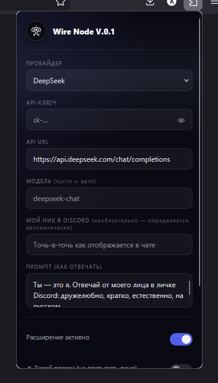
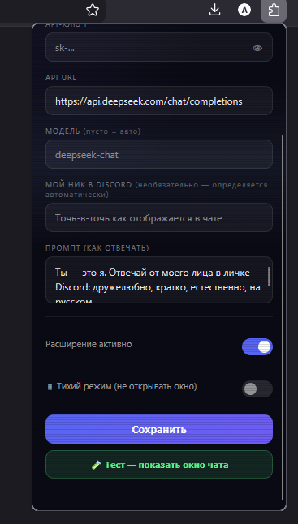
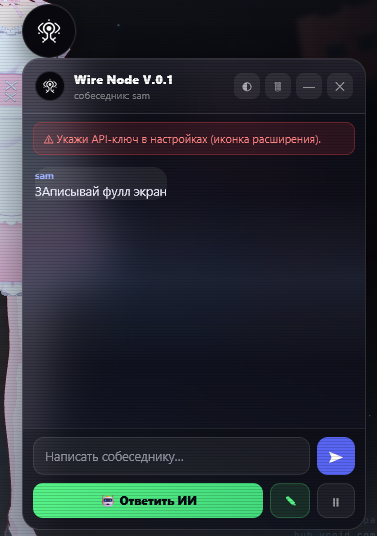

<div align="center">


# ⚡ Wire Node

### AI-powered Discord DM assistant — прямо в браузере

[](https://github.com)
[](https://addons.mozilla.org)
[](https://chrome.google.com/webstore)
[](LICENSE)

<br/>

**Wire Node** — это браузерное расширение, которое слушает твои личные сообщения в Discord и помогает отвечать с помощью нейросети. Плавающее окно-чат появляется прямо поверх любого сайта, генерирует ответ одной кнопкой — и сразу вставляет его в поле ввода Discord.

<br/>

[🌐 Сайт](https://alalal68-wq.github.io/) · [▶️ YouTube](https://www.youtube.com/@python-v7) · [💸 Донат](https://www.donationalerts.com/r/bugcrack1)

<br/>

[](https://github.com/alalal68-wq/Wire_Node/releases/tag/v0.1)

---

</div>

<br/>

## 🎬 Демо

<div align="center">


*Плавающее окно появляется автоматически при входящем сообщении*

</div>

<br/>

## 🖥️ Скриншоты

<div align="center">

<table>
<tr>
<td align="center" width="50%">
<br/>
<sub><b>Настройки расширения — провайдер и ключ</b></sub>
</td>
<td align="center" width="50%">
<br/>
<sub><b>Настройки расширения — тумблеры и сохранение</b></sub>
</td>
</tr>
<tr>
<td align="center" colspan="2">
<br/>
<sub><b>Плавающее окно поверх Discord — видит собеседника, ждёт команды</b></sub>
</td>
</tr>
</table>

</div>

<br/>

## ✨ Возможности

| Функция | Описание |
|---|---|
| 🎯 **Автоопределение собеседника** | Расширение само понимает кто ты, а кто пишет — без ручной настройки |
| 🧠 **Контекст диалога** | Хранит историю переписки отдельно для каждого DM-канала |
| ⚡ **Мгновенная генерация** | Один клик — и ответ от AI готов, вставлен прямо в Discord |
| 🌐 **Любой OpenAI-совместимый API** | DeepSeek, Groq, OpenAI, OpenRouter или свой сервер |
| 🪟 **Плавающее окно** | Работает поверх любого сайта, не только Discord |
| ⏸ **Тихий режим** | Мониторинг включён, но окно не появляется — для скрытного использования |
| 💾 **Отдельная история на канал** | Переключаешься между диалогами — контекст не перемешивается |
| 🔁 **Кроссбраузерный** | Firefox (нативный `browser.*`) и Chrome (через `compat.js` шим) |

<br/>

## ⚡ Быстрый старт — от скачивания до первого ответа AI

### Шаг 1 — Скачай расширение

```bash
# Вариант А: клонировать репозиторий
git clone https://github.com/alalal68-wq/wire-node.git
cd wire-node

# Вариант Б: просто скачать ZIP
# Нажми Code → Download ZIP → распакуй
```

### Шаг 2 — Получи API-ключ

Расширение работает с любым OpenAI-совместимым API. Проще всего начать с **DeepSeek** — он дешёвый и быстрый:

1. Зайди на [platform.deepseek.com](https://platform.deepseek.com)
2. Зарегистрируйся → **API Keys** → **Create new secret key**
3. Скопируй ключ вида `sk-xxxxxxxxxxxxxxxx` — он понадобится на следующем шаге

> Также работают: [Groq](https://console.groq.com) (бесплатно), [OpenAI](https://platform.openai.com), [OpenRouter](https://openrouter.ai)

### Шаг 3 — Загрузи в браузер

**Firefox:**
```
about:debugging
  → "This Firefox"
  → "Load Temporary Add-on..."
  → выбери manifest.json
```

**Chrome / Edge / Brave:**
```
chrome://extensions/   (или edge://extensions/)
  → включи "Developer mode" (правый верхний угол)
  → "Load unpacked"
  → выбери папку wire-node/
```

> ⚠️ **Временная загрузка в Firefox** сбрасывается при перезапуске браузера. Для постоянной установки нужно подписать расширение через [addons.mozilla.org](https://addons.mozilla.org/developers/) или использовать Firefox Developer Edition.

### Шаг 4 — Введи настройки

Нажми на иконку Wire Node в панели браузера:

1. **Провайдер** → выбери `DeepSeek` (или другой)
2. **API-ключ** → вставь ключ из шага 2
3. **Промпт** → оставь по умолчанию или напиши свой стиль общения
4. Нажми **Сохранить** ✓

### Шаг 5 — Открой Discord и напиши кому-нибудь

1. Зайди на [discord.com](https://discord.com) в браузере (не в приложении!)
2. Открой любой личный диалог (DM)
3. Когда собеседник напишет сообщение — плавающее окно Wire Node появится автоматически
4. Нажми **🔄 Сгенерировать** — AI прочитает переписку и придумает ответ
5. Нажми **📤 Отправить** — текст вставится и отправится в Discord

### Проверить что всё работает

Не хочешь ждать реального сообщения? Нажми кнопку **🧪 Тест — показать окно чата** в настройках — окно откроется сразу с тестовым сообщением.

---

## 🚀 Установка

### Firefox
1. Скачай архив [последнего релиза](https://github.com/alalal68-wq/wire-node/releases)
2. Открой `about:debugging` → **"This Firefox"** → **"Load Temporary Add-on"**
3. Выбери файл `manifest.json` из распакованной папки
4. ✅ Готово — иконка Wire Node появится в панели браузера

### Chrome / Edge
1. Скачай и распакуй архив
2. Открой `chrome://extensions/` → включи **"Developer mode"** (правый верхний угол)
3. Нажми **"Load unpacked"** → выбери папку с расширением
4. ✅ Готово

<br/>

## 📦 Как запустить

### 1. Скачай файлы

```bash
git clone https://github.com/alalal68-wq/wire-node.git
cd wire-node
```

Или просто скачай ZIP через **Code → Download ZIP** и распакуй.

---

### 2. Установи в браузер

#### 🦊 Firefox

1. Открой адрес **`about:debugging`**
2. Слева нажми **"This Firefox"**
3. Нажми **"Load Temporary Add-on…"**
4. Выбери файл `manifest.json` из папки проекта
5. Расширение появится в списке — иконка 👁 появится в панели браузера

> ⚠️ Временное расширение сбрасывается при перезапуске Firefox. Для постоянной установки нужна подпись через AMO или используй **Firefox Developer Edition** / **Nightly** с отключённой проверкой подписи (`xpinstall.signatures.required = false` в `about:config`).

#### 🟦 Chrome / Edge / Brave

1. Открой **`chrome://extensions/`** (или `edge://extensions/`)
2. Включи переключатель **"Developer mode"** в правом верхнем углу
3. Нажми **"Load unpacked"**
4. Выбери **папку** с проектом (не отдельный файл)
5. Расширение активно — иконка Wire Node появится в панели

---

### 3. Получи API-ключ

Выбери любой провайдер и зарегистрируйся:

| Провайдер | Где получить ключ | Бесплатный тариф |
|---|---|---|
| **DeepSeek** | [platform.deepseek.com](https://platform.deepseek.com/api_keys) | ✅ есть |
| **Groq** | [console.groq.com](https://console.groq.com/keys) | ✅ есть |
| **OpenAI** | [platform.openai.com](https://platform.openai.com/api-keys) | 💳 платный |
| **OpenRouter** | [openrouter.ai/keys](https://openrouter.ai/keys) | ✅ есть |

---

### 4. Настрой расширение

1. Нажми на иконку **Wire Node** в панели браузера — откроется popup
2. Выбери **провайдера** из списка (URL и модель подставятся автоматически)
3. Вставь **API-ключ**
4. Нажми **«Сохранить»**
5. Нажми **«🧪 Тест — показать окно чата»** — должно появиться плавающее окно

---

### 5. Открой Discord и начни переписку

1. Перейди на **[discord.com](https://discord.com)** (веб-версия)
2. Открой любой **личный диалог (DM)**
3. Как только собеседник напишет — плавающее окно появится автоматически
4. Нажми **«Сгенерировать»** — AI составит ответ на основе контекста переписки
5. Нажми **«Отправить»** — текст вставится в поле ввода Discord и отправится

```
Собеседник написал
       ↓
Плавающее окно появилось
       ↓
[ 🔄 Сгенерировать ] ← нажимаешь
       ↓
AI читает историю переписки → формирует ответ
       ↓
[ 📤 Отправить ] ← нажимаешь
       ↓
Текст вставляется в Discord и отправляется
```

---

### 6. Тонкая настройка (необязательно)

**Свой промпт** — открой popup и измени текст в поле «Промпт». Например:
```
Ты — деловой ассистент. Отвечай кратко и по делу, на русском языке.
```

**Свой ник** — если расширение путает тебя с собеседником, укажи свой Discord-ник в поле «Мой ник в Discord» точь-в-точь как он отображается в чате.

**Тихий режим** — включи «⏸ Тихий режим» чтобы расширение читало сообщения, но окно не всплывало автоматически.

---

## ⚙️ Настройка

Нажми на иконку **Wire Node** в панели браузера:

```
┌── Провайдер ─────────────────────────────┐
│  [DeepSeek ▼]  ← выбери или "Свой"       │
│                                          │
│  API-ключ:  [sk-••••••••••••••••]  [👁]  │
│  API URL:   [https://api.deepseek.com…]  │
│  Модель:    [deepseek-chat]              │
│                                          │
│  Мой ник:   [необязательно]             │
│  Промпт:    [Ты — это я. Отвечай…]      │
│                                          │
│  [✓] Расширение активно                 │
│  [_] Тихий режим                        │
│                                          │
│  [     Сохранить     ]                  │
│  [ 🧪 Тест — показать окно чата ]       │
└──────────────────────────────────────────┘
```

### Поддерживаемые провайдеры

| Провайдер | URL | Модель по умолчанию |
|---|---|---|
| **DeepSeek** | `api.deepseek.com` | `deepseek-chat` |
| **Groq** | `api.groq.com` | `llama-3.3-70b-versatile` |
| **OpenAI** | `api.openai.com` | `gpt-4o-mini` |
| **OpenRouter** | `openrouter.ai` | `deepseek/deepseek-chat` |
| **Свой** | любой URL | задаёшь вручную |

<br/>

## 🔧 Архитектура

```
┌─────────────────────────────────────────────────────┐
│                   БРАУЗЕР                           │
│                                                     │
│  discord.com                                        │
│  ┌───────────────────────────────┐                  │
│  │  discord-monitor.js           │                  │
│  │  • MutationObserver на чат    │                  │
│  │  • Определяет собеседника     │                  │
│  │  • Пересылает NEW_DM ──────────────────────┐    │
│  │  • Принимает SEND_TO_DISCORD               │    │
│  │    и вставляет текст в поле ввода          │    │
│  └───────────────────────────────┘            │    │
│                                               ▼    │
│  ┌─────────────────────────────────────────────┐   │
│  │           background.js (Service Worker)    │   │
│  │                                             │   │
│  │  • Хранит историю по каналам (storage)      │   │
│  │  • Делает fetch() к AI API                  │   │
│  │    (обходит CSP сайтов)                     │   │
│  │  • Рассылает события во все вкладки         │   │
│  └──────────────────┬──────────────────────────┘   │
│                     │                              │
│  любой сайт         │ NEW_DM / ACTIVE_CHANGED      │
│  ┌──────────────────▼──────────────────────────┐   │
│  │  overlay.js                                 │   │
│  │  • Рисует плавающее окно поверх страницы    │   │
│  │  • Кнопка "Сгенерировать" → AI_GENERATE     │   │
│  │  • Кнопка "Отправить" → SEND_TO_DISCORD     │   │
│  └─────────────────────────────────────────────┘   │
│                                                     │
│  compat.js — шим: Chrome.* → browser.*              │
└─────────────────────────────────────────────────────┘
```

### Файловая структура

```
wire-node/
├── manifest.json        # Манифест MV2 (Firefox + Chrome)
├── background.js        # Service worker: AI запросы, хранение истории
├── discord-monitor.js   # Content script для discord.com
├── overlay.js           # Плавающее UI-окно (на всех страницах)
├── compat.js            # Кроссбраузерный шим browser.*
├── popup.html           # Popup настроек с CRT-эффектом
├── popup.js             # Логика popup
├── eye.png              # Логотип
└── icon{16,32,48,128}.png
```

<br/>

## 📜 История разработки

### 🌱 v0.1 — Первый выпуск

Проект родился из одной простой идеи: **зачем вручную придумывать ответы**, если AI может сделать это за тебя — прямо в интерфейсе Discord?

**Что было сложно и как решалось:**

- **CSP блокировал fetch() в content scripts** — решение: вынести все AI-запросы в `background.js`, который не ограничен политикой безопасности сайтов.

- **Discord не раскрывает кто из авторов — ты** — разработан алгоритм `resolveIdentities()`: сначала ищет твой ник в списке авторов, потом сверяет с заголовком диалога, в крайнем случае применяет нечёткое совпадение `looseMatch()`.

- **Дублирование сообщений при переоткрытии чата** — введено окно эхо-дедупликации: 15 секунд после отправки сообщения расширение игнорирует его же при повторном появлении в DOM.

- **Firefox vs Chrome API** — написан `compat.js`, который оборачивает callback-based Chrome API в промисы и кладёт их в `browser.*`, полностью прозрачно для остального кода.

- **История перемешивалась между диалогами** — история теперь хранится как словарь `{ channelId: [...messages] }`, каждый канал изолирован.

- **MutationObserver стрелял слишком часто** — добавлен debounce 250мс, чтобы не перегружать браузер при быстром скролле.

<br/>

## 🛡️ Приватность

- Расширение **не собирает данные** и не отправляет ничего куда-либо, кроме настроенного тобой AI API.
- API-ключ хранится локально в `browser.storage.local` — только на твоём устройстве.
- Переписка уходит в AI только в момент нажатия кнопки «Сгенерировать».

<br/>

## 🤝 Поддержать проект

Если Wire Node помогает тебе — можешь поддержать разработку:

<div align="center">

[](https://www.donationalerts.com/r/bugcrack1)

</div>

<br/>

## 📺 Видео и сайт

<div align="center">

[](https://www.youtube.com/@python-v7)
&nbsp;
[](https://alalal68-wq.github.io/)

</div>

<br/>

## 📄 Лицензия

MIT © 2025 Wire Node

---

<div align="center">
<sub>Сделано с ⚡ и немного паранойей</sub>
</div>
